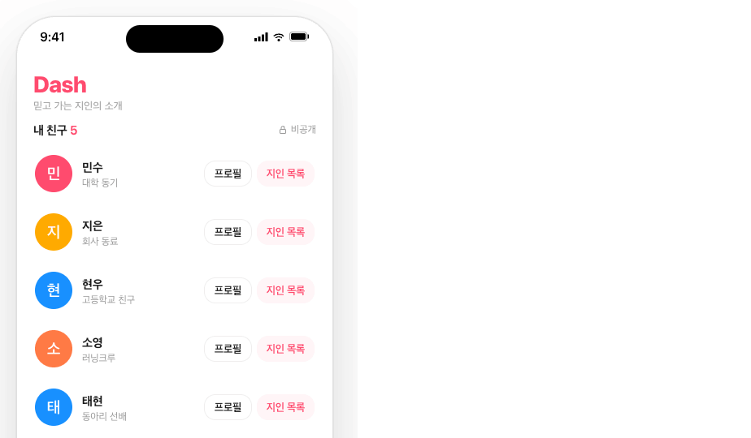
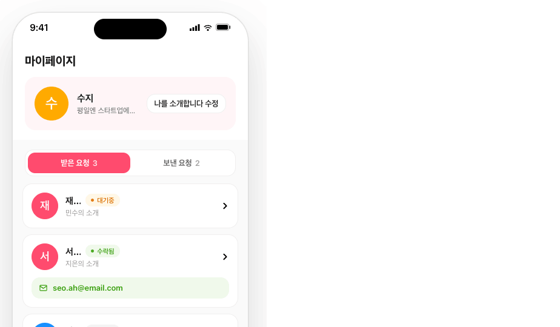
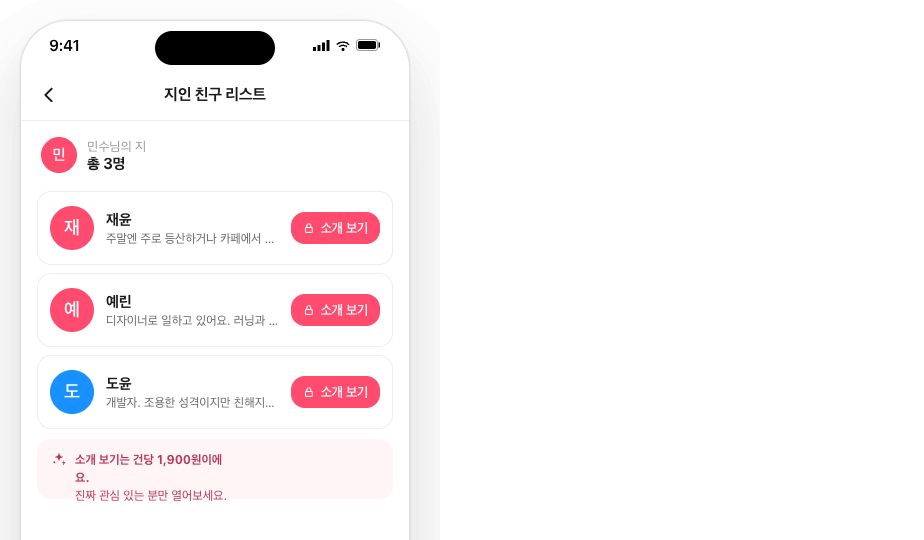
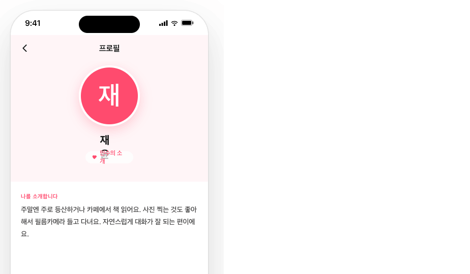
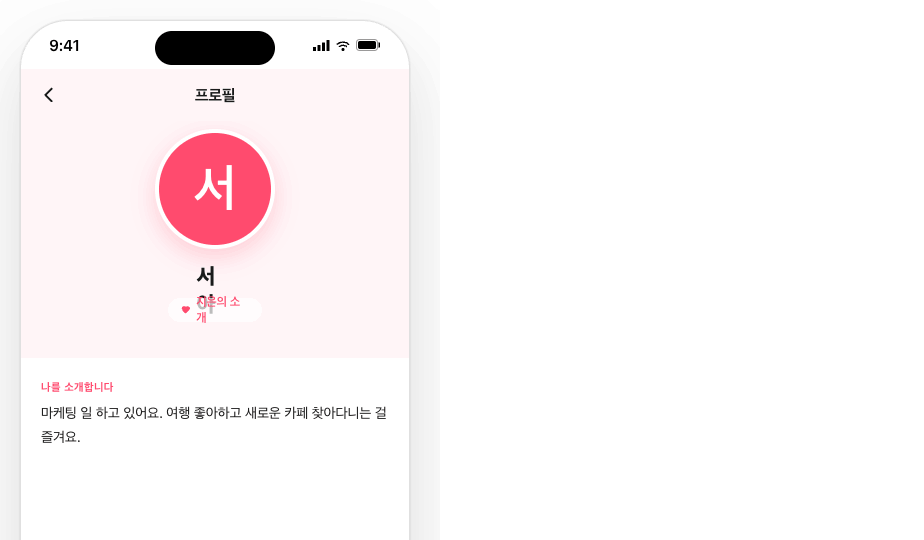
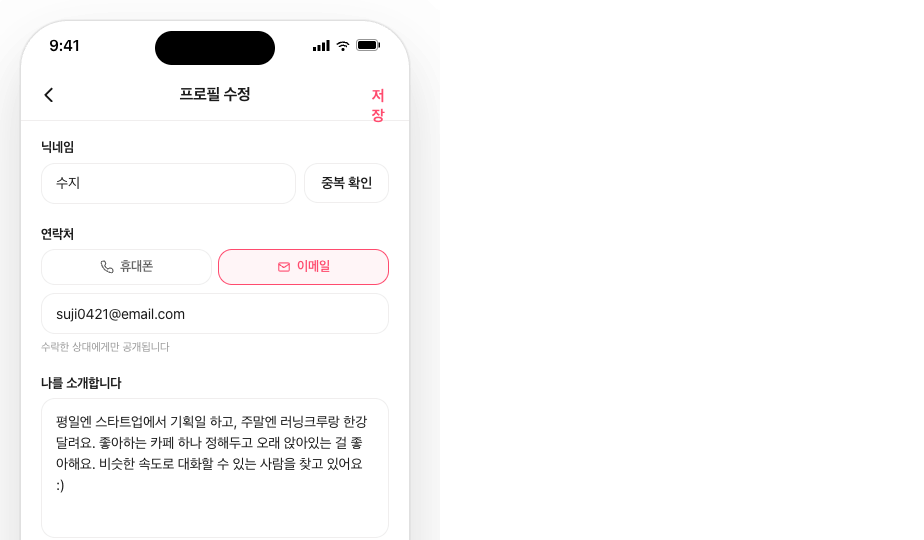

<div align="center">

# Dash

**믿고 가는 지인의 소개 — 지인 네트워크 기반 소개팅 앱**

내 친구의 친구(2촌)부터 시작해 무한히 확장되는 지인 네트워크를 따라가며,
신뢰할 수 있는 사람을 소개받는 iOS / Android 크로스플랫폼 모바일 앱입니다.


</div>

---

## 📖 소개

**Dash**는 모르는 사람을 무작위로 추천하는 기존 소개팅 앱과 달리, **내 지인이 보증하는 사람**을 소개받습니다.

- 친구(1촌)의 친구(2촌)부터 탐색을 시작합니다.
- 2촌 → 3촌 → 4촌 … 으로 **지인 네트워크를 무한히 확장**하며 새로운 사람을 만날 수 있습니다.
- 모든 프로필은 실제 지인 관계로 연결되어 있어, 익명 매칭보다 신뢰도가 높습니다.

---

## 📱 화면

| 홈 — 내 친구 목록 | 마이페이지 — 받은/보낸 요청 | 지인 탐색 (Connections) |
|:---:|:---:|:---:|
|  |  |  |
| 내 친구를 통해 지인 네트워크로 진입 | 프로필 · 연락 요청 관리 · Dash+ 유도 | 2촌부터 무한 확장되는 탐색 |

| 프로필 상세 | 연락 요청 / 수락 | 프로필 편집 |
|:---:|:---:|:---:|
|  |  |  |
| 자기소개 열람 (모든 촌수 무료) | 수락 시 연락처 공개 | 닉네임 · 연락처 · 자기소개 |

> Android 화면은 [`design_handoff_dash/screenshots/`](design_handoff_dash/screenshots/) 에서 확인할 수 있습니다.

---

## ⚙️ 핵심 제품 규칙

| 항목 | 규칙 |
|---|---|
| **소개 보기 (프로필 열람)** | 모든 촌수 **무료** |
| **연락 요청 (신청)** | 1~2촌 **무료** · 3촌 이상은 **Dash+ 필요** |
| **과금** | Dash+ 구독 **단일 상품**만 (건당 결제·크레딧 없음) |
| **인증** | Apple / Google 소셜 로그인만 (카카오·이메일 없음) |
| **언어 / 테마** | 한국어 전용 · 다크모드 미지원 (v1) |

---

## 🧭 네비게이션 플로우

```
[Login] ──(신규)──> [Profile Edit · 첫 설정] ──> [Home]
   │                                              │
   └────────(기존 유저)───────────────────────────┘
                                                  │
[Home] ─tab─ [MyPage]                             │
   │            ├─ 받은 요청 → [Profile Detail · 수락모드]
   │            ├─ 보낸 요청 → [Profile Detail · 상태별]
   │            ├─ 프로필 수정 → [Profile Edit]
   │            └─ Dash+ 유도 → [Dash Plus]
   │
   └─ 친구의 [지인 목록] → [Connections · 2촌]
                              ├─ 카드 [소개 보기] → [Profile Detail]
                              └─ 카드 [지인 더보기] → [Connections · 3촌] (Dash+)
                                                       └─ … 4촌, 5촌 무한 확장
```

---

## 🛠 기술 스택

| 영역 | 기술 |
|------|------|
| **백엔드** | Spring Boot 3.3 · Java 21 · Lombok · PostgreSQL 16 · JWT · Flyway |
| **프론트엔드** | React Native · Expo Router · TypeScript · Zustand · React Query |
| **인프라** | Docker Compose (PostgreSQL · BE · FE) |

---

## 🏗 아키텍처

### BE — 헥사고날 (Ports & Adapters) + DDD

바운디드 컨텍스트별 4개 서브패키지로 구성됩니다.

```
┌───────────────────────────────────────────────┐
│  presentation     Controller / DTO             │
├───────────────────────────────────────────────┤
│  application      UseCase Service (@Transactional) │
├───────────────────────────────────────────────┤
│  domain           애그리거트 / VO / Repository 포트  │ ← 순수 Java, 프레임워크 의존 0
├───────────────────────────────────────────────┤
│  infrastructure   JpaEntity / Adapter / Mapper  │ ← 포트 구현
└───────────────────────────────────────────────┘
     presentation → application → domain ← infrastructure(adapter)
```

**핵심 규칙**
- Domain 패키지에 Spring / JPA 어노테이션 절대 금지 (프레임워크 의존 0)
- Repository 포트는 domain 소유, 어댑터가 infrastructure에서 구현
- 애그리거트 간 참조는 ID/VO로 (`MemberId`) — JpaEntity는 FK를 `Long` 컬럼으로 매핑
- 모든 사용자 엔드포인트에 `@PreAuthorize`, DB 쓰기에 `@Transactional` 필수

**바운디드 컨텍스트**: `auth` · `member` · `user` · `profile` · `friendship` · `invitation` · `contactrequest`

### FE — 레이어드 아키텍처

```
┌──────────────────────────────────┐
│  Presentation   screens / components │
├──────────────────────────────────┤
│  Application    hooks / stores    │
├──────────────────────────────────┤
│  Data           services / API    │
├──────────────────────────────────┤
│  Infrastructure storage / device  │
└──────────────────────────────────┘
```

**핵심 규칙**
- 화면에서 `axios` 직접 호출 금지 — `services/` 통해서만
- JWT는 MMKV(encrypted)에 저장 — AsyncStorage 금지
- 서버 상태는 React Query · 전역 상태는 Zustand

---

## 📂 프로젝트 구조

```
dash/
├── BE/                   Spring Boot 3.3 + Java 21 REST API
│   └── src/main/java/com/dash/
│       ├── auth/ member/ user/ profile/
│       ├── friendship/ invitation/ contactrequest/
│       └── global/       config · security · exception
├── FE/                   React Native + Expo (iOS + Android)
│   └── app/              Expo Router 라우트
│       ├── (tabs)/       홈 · 마이페이지
│       ├── profile/      프로필 상세 · 편집
│       ├── acquaintances/ 지인 탐색
│       ├── invite/       초대 링크
│       ├── login.tsx     소셜 로그인
│       └── upgrade.tsx   Dash+ 업그레이드
├── design_handoff_dash/  디자인 핸드오프 · 스크린샷
└── docker-compose.yml    DB · BE · FE 통합 실행
```

---

## 🚀 시작하기

### Docker Compose (권장)

PostgreSQL · 백엔드 · 프론트엔드를 한 번에 실행합니다.

```bash
docker compose up --build
```

- DB: `localhost:5432` (`dash_db` / `dash_user`)
- BE: `localhost:8080`
- FE: Expo Dev Server (host network)

### 개별 실행

**백엔드**
```bash
cd BE
./gradlew bootRun
```

**프론트엔드**
```bash
cd FE
npm install
npx expo start
```

> 프론트엔드는 `.env.example` 을 복사해 `.env` 를 구성하세요.

---

## 🔌 환경 변수

| 위치 | 파일 | 비고 |
|---|---|---|
| BE | `BE/.env` | DB · JWT 설정 (gitignore) |
| FE | `FE/.env` | API base URL 등 (`FE/.env.example` 참고) |

---

<div align="center">

지인 네트워크로 연결되는 소개, **Dash** 🩷

</div>
